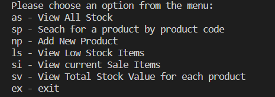
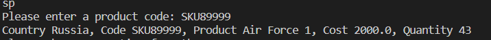
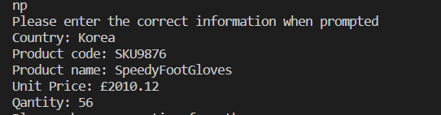
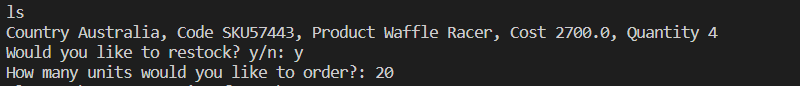
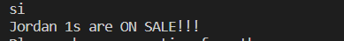
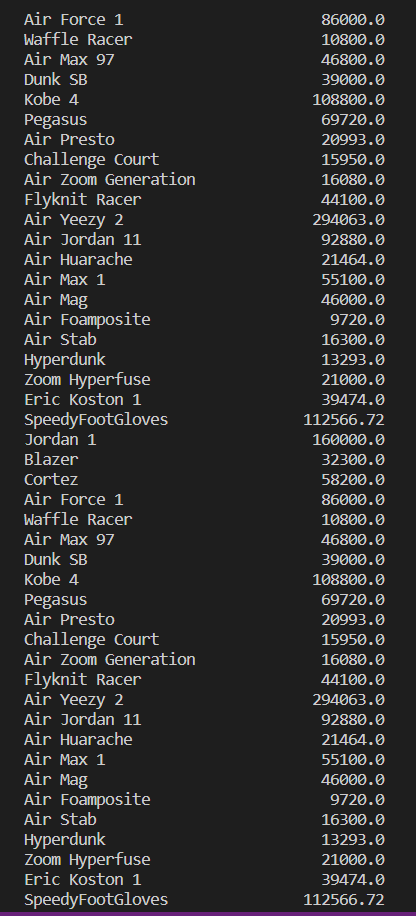

# Shoe Stock Manager

A program designed to track product stock for a a shoe company.
For each product the following details are required
* Country
* SKU code
* Product Name
* Unit value
* Stock Quanity

All these details are stored in a text file "inventory.txt".

The program allows the user to see all stock data or the data for a single product. They can also check total stock value, 
find high quantity stock items and mark them as "on sale",  find low quantity items and restock or add new stock items.

## Contents

1. Installation
1. Usage Guide
1. Credits

## Installation
To run this program you will need to have python installed as well as an IDE, SVCode or Pycharm are reccomended.
Then simply open the file and run it.

## Usage Guide
### Main Menu

The main menu should appear like this, to choose an option mearly type the appropriate abrieviation (e.g."as" or "sp")

### View All Stock
Type in "as" and press enter to see the full table of stock data.
It should appear as below.

You will then be returned to the main menu

### Search for a product by code
Type in "sp" and press enter
You will then be asked to to enter an SKU code, once you have done this it should desplay as below.

You will then be returned to the main menu

### Add New Product
Enter "np".
You will be prompted to enter data specific to the new shoe item you wish to input.

The data will be added to the text file and you will be returned to the main menu.

### View Low Stock Items
Enter "ls"
You will be shown the item with the lowest stock quantity then asked if you wish to restock that item

### View Current Sale Items
Enter "si"
The program will find the item with the highest Stock Quantity and declare it "ON Sale!!!"

### View Total Stock Values
Enter "sv"
You will be shown a table of Product names with the total stock value for each product

### Exit
Enter "ex" to exit the program

## Credits
Created by Timothy Whitehead
Created as a project for a Software Engineering Bootcamp run by Hyperion Dev

